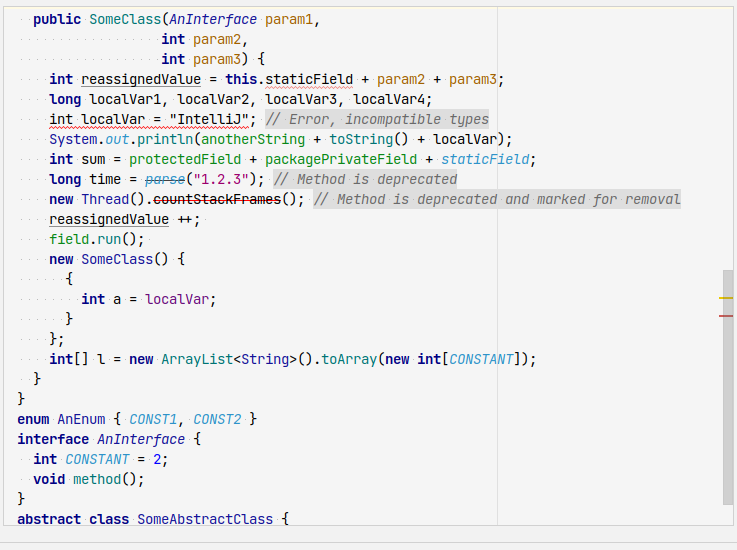
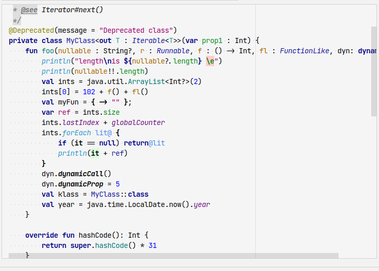
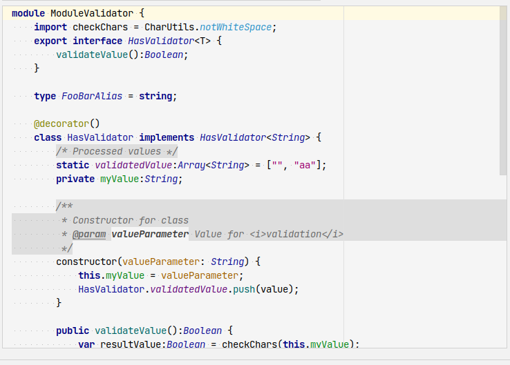
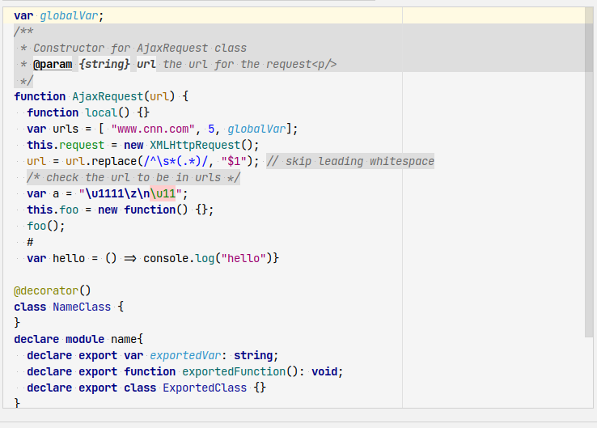
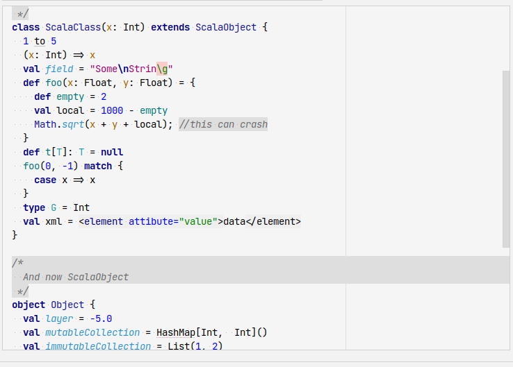
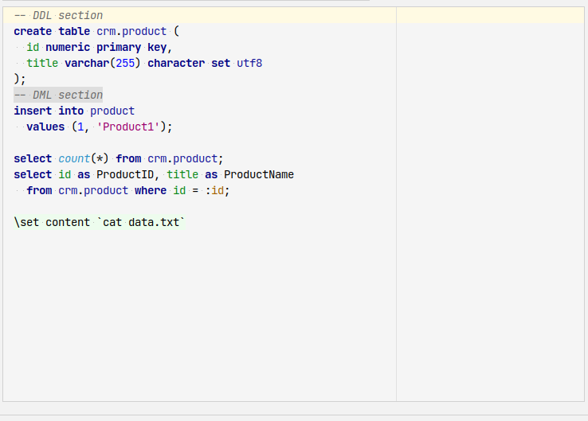
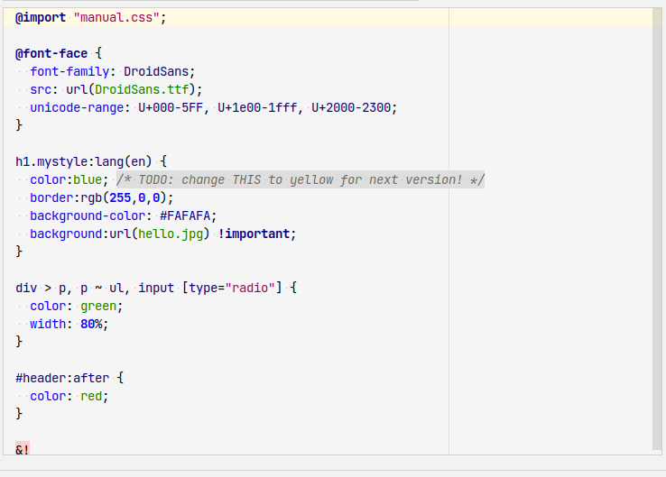
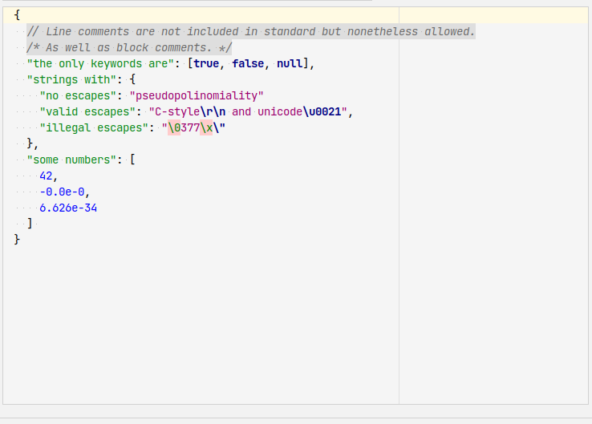

# intellij-colors-spoonman

Spoonman color scheme for IntelliJ IDEA and other IDEs - PyCharm, WebStorm, PhpStorm, RubyMine etc.

Features:
- Light background, not #FFFFFF white so it doesn't burn your eyes nor your display
- Distinct colors for local variables, method parameters, methods, keywords, statics and many others
- You can easily guess every word's category by the color
- No bright colors

## Installation

1. Clone this repository:

    ```bash
    $ cd ~/Downloads
    $ git clone git@github.com:SpOOnman/intellij-colors-spoonman.git
    ```

2. Copy color scheme file to your IDE color config directory 
    
    ```bash
    # For Linux:
    $ cp ~/Downloads/intellij-colors-spoonman/colors/Spoonman.icls ~/.config/JetBrains/IntelliJIdea2023.1/colors/
    
    # For MacOS:
    $ cp ~/Downloads/intellij-colors-spoonman/colors/Spoonman.icls ~/Library/Application Support/JetBrains/IntelliJIdea2023.1/colors/
    ```

3. Select Color Scheme and choose `Spoonman`.

If you have problems finding `colors` directory of you IDE check JetBrains' manual on used paths [here](https://www.jetbrains.com/help/idea/directories-used-by-the-ide-to-store-settings-caches-plugins-and-logs.html).

## Screenshots

- Java: 
- Kotlin: 
- TypeScript: 
- JavaScript: 
- Scala: 
- SQL: 
- CSS: 
- JSON: 

## License

Released under the [MIT](LICENSE) License.